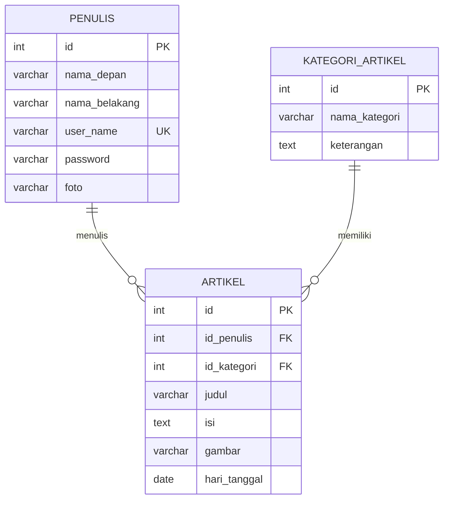

<div align="center">

<!-- Header Banner -->


<!-- Badges -->
<p>
  
  
  
  
</p>

<p>
  
  
  
  
</p>

<p><i>Aplikasi CMS Blog berbasis Laravel 11 — Tugas UAS Web Programming</i></p>

<a href="https://github.com/i-m-rangga/aplikasi-blog-240605110158">
  
</a>

</div>

---

<!-- Identitas -->
<table align="center">
  <tr>
    <td align="center" width="100">👤</td>
    <td>
      <strong>Nama Lengkap</strong><br/>
      Dika Muhammad Iqbal Marangga
    </td>
    <td align="center" width="100">🎓</td>
    <td>
      <strong>NIM</strong><br/>
      240605110158
    </td>
  </tr>
  <tr>
    <td align="center">📚</td>
    <td>
      <strong>Mata Kuliah</strong><br/>
      Web Programming
    </td>
    <td align="center">📅</td>
    <td>
      <strong>Semester</strong><br/>
      Genap 2025/2026
    </td>
  </tr>
</table>

---

## 📋 Deskripsi Aplikasi

<blockquote>
<strong>Nusantara News</strong> adalah aplikasi <em>Content Management System</em> (CMS) Blog full-stack yang dibangun menggunakan <strong>Laravel 11</strong> dan <strong>Bootstrap 5</strong>. Aplikasi ini dirancang sebagai proyek tugas akhir (UAS) mata kuliah Web Programming, mencakup fitur CRUD lengkap untuk pengelolaan konten blog, autentikasi admin, serta halaman publik yang responsif dan elegan.
</blockquote>

<br/>

<div align="center">
<table>
<tr>
<td align="center" width="50%">

### 🔐 Panel Admin (Back-End)
Halaman khusus penulis/administrator<br/>yang dilindungi middleware `auth`

</td>
<td align="center" width="50%">

### 🌐 Halaman Publik (Front-End)
Halaman untuk pengunjung umum<br/>tanpa perlu autentikasi

</td>
</tr>
<tr>
<td>

- ✅ Login & Logout (`tabel penulis`)
- ✅ Dashboard Admin
- ✅ CRUD Artikel + upload gambar cover
- ✅ CRUD Kategori Artikel
- ✅ CRUD Penulis + upload foto profil

</td>
<td>

- ✅ Beranda — 5 artikel terbaru
- ✅ Filter artikel berdasarkan kategori
- ✅ Detail artikel lengkap
- ✅ Sidebar artikel terkait (5 maks)
- ✅ Widget daftar kategori

</td>
</tr>
</table>
</div>

---

## 🏗️ Arsitektur Proyek

```
aplikasi-blog-240605110158/
│
├── 📂 app/
│   ├── 📂 Http/Controllers/
│   │   ├── 📄 PublicController.php         ← Controller publik (beranda & detail)
│   │   ├── 📄 ArtikelController.php        ← CRUD artikel (admin)
│   │   ├── 📄 PenulisController.php        ← CRUD penulis (admin)
│   │   ├── 📄 KategoriArtikelController.php ← CRUD kategori (admin)
│   │   ├── 📄 LoginController.php          ← Autentikasi login/logout
│   │   └── 📄 DashboardController.php      ← Dashboard admin
│   │
│   └── 📂 Models/
│       ├── 📄 Artikel.php          → belongsTo Penulis, KategoriArtikel
│       ├── 📄 KategoriArtikel.php  → hasMany Artikel
│       └── 📄 Penulis.php          → hasMany Artikel
│
├── 📂 resources/views/
│   ├── 📂 layouts/
│   │   ├── 📄 app.blade.php           ← Layout admin (sidebar + auth)
│   │   └── 📄 public.blade.php        ← Layout publik (navbar + footer)
│   ├── 📂 public/
│   │   ├── 📄 beranda.blade.php       ← Halaman beranda publik
│   │   └── 📄 detail.blade.php        ← Halaman detail artikel
│   ├── 📂 artikel/                    ← Views CRUD artikel (admin)
│   ├── 📂 penulis/                    ← Views CRUD penulis (admin)
│   ├── 📂 kategori/                   ← Views CRUD kategori (admin)
│   ├── 📂 login/                      ← Halaman login
│   └── 📂 dashboard/                  ← Halaman dashboard
│
├── 📂 routes/
│   └── 📄 web.php                     ← Routing admin (auth) & publik
│
├── 📂 storage/app/public/
│   ├── 📂 gambar/                     ← Cover artikel
│   └── 📂 foto/                       ← Foto profil penulis
│
└── 📂 database/migrations/            ← Skema tabel database
```

---

## 🗄️ Struktur Database

<div align="center">



</div>

<details>
<summary><strong>📊 Klik untuk melihat tabel ringkasan</strong></summary>
<br/>

| Tabel | Kolom | Relasi |
|:------|:------|:-------|
| `penulis` | `id` · `nama_depan` · `nama_belakang` · `user_name` · `password` · `foto` | `hasMany` → Artikel |
| `kategori_artikel` | `id` · `nama_kategori` · `keterangan` | `hasMany` → Artikel |
| `artikel` | `id` · `id_penulis` · `id_kategori` · `judul` · `isi` · `gambar` · `hari_tanggal` | `belongsTo` → Penulis, KategoriArtikel |

</details>

---

## 🗺️ Route Map

<div align="center">

| Method | URI | Controller | Middleware | Keterangan |
|:------:|:-----|:-----------|:----------:|:-----------|
| `GET` | `/` | `PublicController@beranda` | — | 🌐 Beranda publik |
| `GET` | `/artikel/{id}` | `PublicController@detail` | — | 🌐 Detail artikel |
| `GET` | `/login` | `LoginController@index` | `guest` | 🔑 Form login |
| `POST` | `/login` | `LoginController@proses` | `guest` | 🔑 Proses login |
| `POST` | `/logout` | `LoginController@logout` | `auth` | 🔒 Logout |
| `GET` | `/dashboard` | `DashboardController@index` | `auth` | 🔒 Dashboard |
| `*` | `/artikel/*` | `ArtikelController` (resource) | `auth` | 🔒 CRUD Artikel |
| `*` | `/penulis/*` | `PenulisController` (resource) | `auth` | 🔒 CRUD Penulis |
| `*` | `/kategori/*` | `KategoriArtikelController` (resource) | `auth` | 🔒 CRUD Kategori |

</div>

---

## 🚀 Cara Menjalankan Aplikasi

<details open>
<summary><strong>📋 Prasyarat</strong></summary>
<br/>

| Software | Versi Minimum | Keterangan |
|:---------|:-------------|:-----------|
| PHP | `>= 8.2` | Runtime utama |
| Composer | Latest | Dependency manager PHP |
| MySQL | `>= 8.0` | Database server |
| XAMPP / Laragon | *(opsional)* | Alternatif all-in-one |

</details>

<br/>

### 📥 Langkah 1 — Clone Repositori

```bash
git clone https://github.com/i-m-rangga/aplikasi-blog-240605110158.git
cd aplikasi-blog-240605110158
```

### 📦 Langkah 2 — Install Dependensi

```bash
composer install
```

### ⚙️ Langkah 3 — Konfigurasi Environment

```bash
cp .env.example .env
```

Edit file `.env`, sesuaikan konfigurasi database:

```env
DB_CONNECTION=mysql
DB_HOST=127.0.0.1
DB_PORT=3306
DB_DATABASE=db_blog
DB_USERNAME=root
DB_PASSWORD=
```

### 🔑 Langkah 4 — Generate Application Key

```bash
php artisan key:generate
```

### 🗄️ Langkah 5 — Siapkan Database

Buat database `db_blog` di MySQL/phpMyAdmin, lalu jalankan migrasi:

```bash
php artisan migrate
```

### 🔗 Langkah 6 — Buat Storage Symlink

```bash
php artisan storage:link
```

> Perintah ini menghubungkan folder `storage/app/public` ke `public/storage` agar gambar cover artikel dan foto penulis bisa diakses melalui browser.

### 🖥️ Langkah 7 — Jalankan Server

```bash
php artisan serve
```

<div align="center">

### 🎉 Aplikasi siap diakses!

| URL | Keterangan |
|:----|:-----------|
| [`http://127.0.0.1:8000`](http://127.0.0.1:8000) | 🌐 Halaman Beranda Publik |
| [`http://127.0.0.1:8000/login`](http://127.0.0.1:8000/login) | 🔑 Halaman Login Admin |
| [`http://127.0.0.1:8000/dashboard`](http://127.0.0.1:8000/dashboard) | 🔒 Dashboard Admin |

</div>


---

## 🛠️ Tech Stack

<div align="center">

<table>
<tr>
<td align="center" width="140">
  
  <br/><strong>Laravel 11</strong>
  <br/><sub>Back-End Framework</sub>
</td>
<td align="center" width="140">
  
  <br/><strong>PHP 8.2+</strong>
  <br/><sub>Server Runtime</sub>
</td>
<td align="center" width="140">
  
  <br/><strong>MySQL 8.x</strong>
  <br/><sub>Database</sub>
</td>
<td align="center" width="140">
  
  <br/><strong>Bootstrap 5.3</strong>
  <br/><sub>CSS Framework</sub>
</td>
</tr>
<tr>
<td align="center" width="140">
  
  <br/><strong>Blade</strong>
  <br/><sub>Template Engine</sub>
</td>
<td align="center" width="140">
  
  <br/><strong>Custom CSS</strong>
  <br/><sub>Styling</sub>
</td>
<td align="center" width="140">
  
  <br/><strong>JavaScript</strong>
  <br/><sub>Interaktivitas</sub>
</td>
<td align="center" width="140">
  
  <br/><strong>Composer</strong>
  <br/><sub>Package Manager</sub>
</td>
</tr>
</table>

</div>

---

## ✨ Fitur Utama

<div align="center">
<table>
<tr>
<td width="50%">

### 🌐 Halaman Publik
- 📰 **Beranda** — 5 artikel terbaru dengan card
- 🏷️ **Filter Kategori** — Klik sidebar untuk filter
- 📖 **Detail Artikel** — Tampilan lengkap + foto penulis
- 🔗 **Artikel Terkait** — 5 artikel dari kategori sama
- 📱 **Responsive** — Tampilan optimal di semua perangkat
- 🎨 **Desain Elegan** — Google Fonts + Bootstrap Icons

</td>
<td width="50%">

### 🔒 Panel Admin
- 🔑 **Autentikasi** — Custom auth dengan tabel `penulis`
- 📊 **Dashboard** — Ringkasan informasi
- ✍️ **Kelola Artikel** — CRUD + upload gambar cover
- 📁 **Kelola Kategori** — CRUD kategori artikel
- 👥 **Kelola Penulis** — CRUD + upload foto profil
- 🗂️ **Laravel Storage** — Manajemen file terorganisir

</td>
</tr>
</table>
</div>

---

## 🎥 Video Demonstrasi

<div align="center">

> 📺 **Tonton demo lengkap aplikasi Nusantara News di YouTube:**

<a href="https://youtu.be/LINK_VIDEO_YOUTUBE_ANDA">
  
</a>

<br/><br/>

> ⚠️ *Ganti `LINK_VIDEO_YOUTUBE_ANDA` pada link di atas dengan URL video YouTube Anda.*

</div>

---

<div align="center">

<!-- Footer -->


<p>
  Dibuat dengan ❤️ oleh <strong>Dika Muhammad Iqbal Marangga</strong> — <strong>240605110158</strong>
  <br/>
  <sub>Web Programming • Genap 2024/2025 • Laravel 11 + Bootstrap 5</sub>
</p>

</div>
